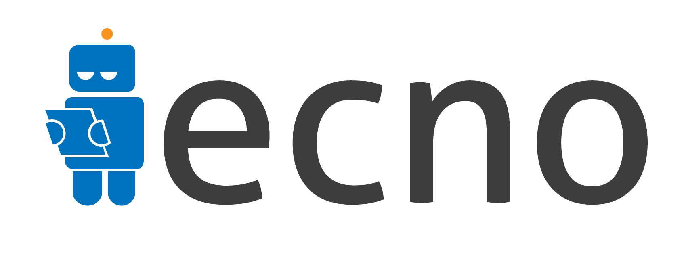

<p align="center">
<a href="https://travis-ci.org/xmartlabs/Ecno"></a>

<a href="https://developer.apple.com/swift"></a>
<a href="https://github.com/Carthage/Carthage"></a>
<a href="https://cocoapods.org/pods/Ecno"></a>
<a href="https://raw.githubusercontent.com/xmartlabs/Ecno/master/LICENSE"></a>
</p>

<p align="center">
By <a href="https://xmartlabs.com/">Xmartlabs SRL</a>.
</p>

## Introduction

**Ecno** was inspired by [Once](https://github.com/jonfinerty/Once) Android library. It's a task state manager built on top of UserDefaults in pure Swift 4. This abstraction allows you to mark 'tasks' as done, 'to-do' and check for those states.  

**Ecno** is ideal for:
* Show tutorials once within the application.
* Perform certain task periodically.
* Trigger a task based on a user action.


## Usage

First you need to initialize it:

```swift
Ecno.initialize()
```
> Note: you should initialize it when your app gets launched.

Then, you can check whether a task was done by:
```swift
if !Ecno.beenDone("task") {
  //...
  Ecno.markDone("task")
}
```

Also, you can check for specific requirements about a certain task:
```swift
if Ecno.beenDone("task", scope: .appSession, numberOfTimes: .moreThan(3)) {
  // do stuff
}
```
or
```swift
if Ecno.beenDone("task", scope: .since(20.minutes), numberOfTimes: .lessThan(3)) {
  // do stuff
}
```
Additionally, you can program a 'to do' task by:
```swift
Ecno.toDo("show banner", scope: .until(3.hours), info: ["name": "bannerName"])
```
and then query if you need to do that task:
```swift
if Ecno.needToDo("show banner") {
  let info = Ecno.infoForToDo("show banner") // ["name": "bannerName"]
  // ...
}
```


## Task

Any type conforming to the `Task` protocol. Since it would be the most common case, the `String` type already conforms to `Task`.

```swift
public protocol Task {

    var tag: String { get }

}
```


## Scope

Scopes represents periods of time within the application.

* `.appInstall`  
This period represents all times for the application.
* `.appVersion`  
Period starting when the current version of the app was installed.
* `.appSession`  
Period starting when the application was launched.
* `.since(TimeInterval)`  
Period starting since `TimeInterval` time ago from now. For instance, `.since(2.days)`
* `.until(TimeInterval)`  
Period valid until `TimeInterval` from now. For instance, `.until(3.hours)`. This should be useful to set a 'to do' task that expires.

## Functions

* `func toDo(_ task: Task, scope: Scope? = nil, info: [AnyHashable: Any]? = nil)`  
Marks a task as 'to do' within a given scope, if it has already been marked as to do or been done within that scope then it will not be marked. If the scope is nil, then it will be marked as to do anyways.
* `func needToDo(_ task: Task) -> Bool`  
Checks if a task is currently marked as 'to do'.
* `func infoForToDo(_ task: Task) -> [AnyHashable: Any]?`  
Gets the info associated with a 'to do' task. (only if you provided it in the `toDo(...)` function)
* `func lastDone(_ task: Task) -> Date?`  
Last done timestamp for a given task.
* `func beenDone(_ task: Task, scope: Scope = .appInstall, numberOfTimes: CountChecker = .moreThan(0)) -> Bool`  
Checks if a task has been done with the given requirements.
* `func markDone(_ task: Task)`  
Marks a task as done.


## Requirements

* iOS 8.0+
* Swift 4.0+
* Xcode 9.0+

## Getting involved

* If you **want to contribute** please feel free to **submit pull requests**.
* If you **have a feature request** please **open an issue**.
* If you **found a bug** or **need help** please **check older issues**

Before contribute check the [CONTRIBUTING](https://github.com/xmartlabs/Ecno/blob/master/CONTRIBUTING.md) file for more info.

If you use **Ecno** in your app We would love to hear about it! Drop us a line on [twitter](https://twitter.com/xmartlabs).

## Examples

Follow these 3 steps to run Example project:

* Clone Ecno repository
* Open Ecno workspace and run the *Example* project.

## Installation

#### CocoaPods

[CocoaPods](https://cocoapods.org/) is a dependency manager for Cocoa projects.

To install Ecno, simply add the following line to your Podfile:

```ruby
pod 'Ecno', '~> 3.0'
```

#### Carthage

[Carthage](https://github.com/Carthage/Carthage) is a simple, decentralized dependency manager for Cocoa.

To install Ecno, simply add the following line to your Cartfile:

```ogdl
github "xmartlabs/Ecno" ~> 3.0
```

## Author

* [Diego Ernst](https://github.com/dernster)

# Change Log

This can be found in the [CHANGELOG.md](CHANGELOG.md) file.
